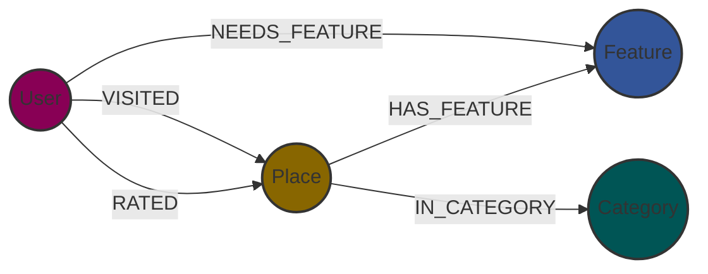

# 🌍 Place Recommendation System


> A Context-Aware Recommendation Backend powered by **Graph Theory**.

## 📖 Overview

This project implements a RESTful API designed to power a tourism discovery platform. Unlike traditional SQL-based 
directories, this system uses a **Knowledge Graph** to model the complex relationships between travelers, locations, 
and accessibility requirements.

By leveraging **Neo4j**, the API enables semantic queries (e.g., *"Find places visited by people like me who also need 
wheelchair access"*) that would be computationally expensive in relational databases.

## 🏗️ Architecture & Data Model

The core of the system is a Graph Schema designed for scalability and high-performance filtering.



## ⚡ Key Features

* **Graph-Native queries:** Efficient traversal of user interactions and place attributes using pure **Cypher**.
* **Secure implementation:** Prevents **Cypher Injection** via strict allow-listing and parameterization.
* **Automatic documentation:** Fully interactive OpenAPI interface.
* **Data integrity:** Enforced by Pydantic models and Neo4j constraints.
* **Pagination & sorting:** Optimized endpoints handling large datasets.

## 🚀 Getting Started

### Prerequisites
* Docker & Docker Compose (Recommended for Neo4j)
* Python 3.10+

### 1. Start the Database
Run Neo4j using Docker:
```bash
docker run -d \
    --name neo4j-place-recommendation-system \
    --restart always \
    -p 7474:7474 -p 7687:7687 \
    -e NEO4J_AUTH=neo4j/neo4j \
    -v /path/to/your/data:/data
    neo4j:2025.12.1
```

### 2. Install Dependencies
```bash
pip install -r requirements.txt
```

### 3. Setup environment
```bash
cp .env.example .env
# fill it with your variables
```

### 4. Run the API
```bash
uvicorn app.main:app --reload
```

The API will be available at: `http://localhost:8000`

## 📚 API Documentation

Once the server is running, explore the interactive documentation:

* **Swagger UI:** [`http://localhost:8000`](http://localhost:8000/docs)
* **ReDoc:** [`http://localhost:8000/redoc`](http://localhost:8000/redoc)

---

_Project developed by **Joan Navarro** as part of a Graph Data Engineering portfolio._