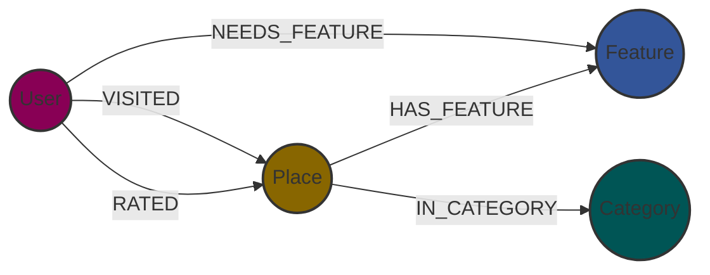

# 🌍 Place Recommendation System


> A Context-Aware Recommendation Backend powered by **Graph Theory**.

## 📖 Overview

This project implements a RESTful API designed to power a tourism discovery platform. Unlike traditional SQL-based 
directories, this system uses a **knowledge graph** to model the complex relationships between travelers, locations, 
and their requirements or features.

By leveraging **Neo4j**, the API enables semantic queries (e.g., *"Find places visited by people like me who also need 
wheelchair access"*) that would be computationally expensive in relational databases.

## 🏗️ Architecture

The system is built following a strict **layered architecture** (Router ↔ Service ↔ DAO) to ensure scalability and 
maintainability.

### Software Pattern
* **Routers:** Handle HTTP requests and input validation (Pydantic).
* **Services:** Contain business logic, transactional boundaries, and orchestration.
* **DAOs (Data Access Objects):** Execute raw Cypher queries and handle DB communication.

### Data Model
The core is a graph schema designed for high-performance filtering:


## ⚡ Key Features

* **Graph-native logic:** Recommendations based on traversal patterns, not just attribute matching.
* **Layered architecture:** Professional separation of concerns ensuring testability and modularity.
* **Service-to-Service security:** Protected endpoints via API Key Authentication, designed for internal microservice 
communication.
* **Transactional integrity:** Service-managed transactions ensuring ACID compliance across multiple graph operations.
* **Automated testing:** Integrated `pytest` suite with fixture-based database cleanup.

## 🚀 Getting Started

The entire stack (API + Database) is containerized. You can launch it with a single command.

### 1. Configure Environment
```bash
# Create the docker environment file
cp .env.example .env.docker

# (Optional) Edit .env.docker to set your own passwords/keys
```

### 2. Launch with Docker Compose
```bash
docker-compose up --build
```
*Wait a few seconds for Neo4j to accept connections.*

* **API Documentation:** [`http://localhost:8000/docs`](http://localhost:8000/docs)
* **Neo4j Browser:** [`http://localhost:7474`](http://localhost:7474)

## 🧪 Testing

The project uses `pytest` for integration testing. To ensure data integrity and prevent pollution of your development/production database, tests must be executed against a **dedicated Neo4j Test Instance**.

### 1. Configure Test Environment
Create a `.env.test` file specifically for the test runner. This file should point to an isolated Neo4j instance (e.g., running on a different port or a separate Docker container).

```bash
cp .env.example .env.test
# ⚠️ IMPORTANT: Edit .env.test and set NEO4J_HOSTNAME/PORT to your dedicated TEST instance.
# Do NOT point this to your production data!
```

### 2. Run Tests (Local)
Once configured, execute the tests locally. The suite includes fixtures that will **automatically wipe the database** defined in `.env.test` before running to ensure a clean state.

```bash
pytest app/tests -rA
```
```
---

_Project developed by **Joan Navarro** as part of a Graph Data Engineering portfolio._